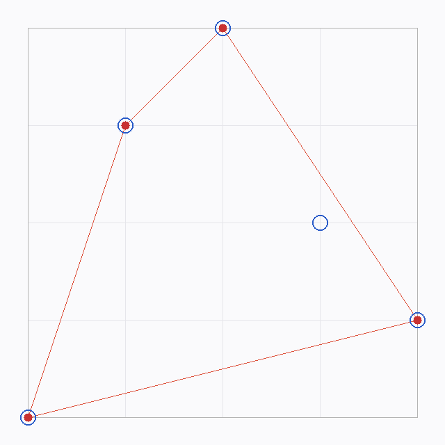
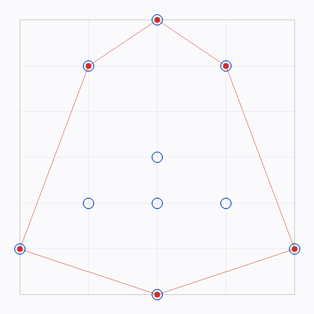
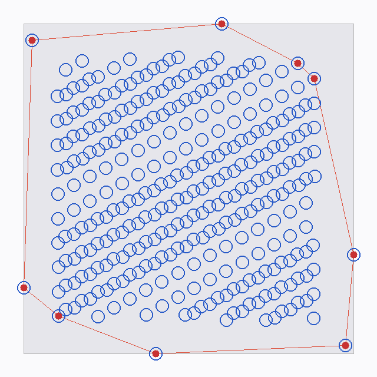
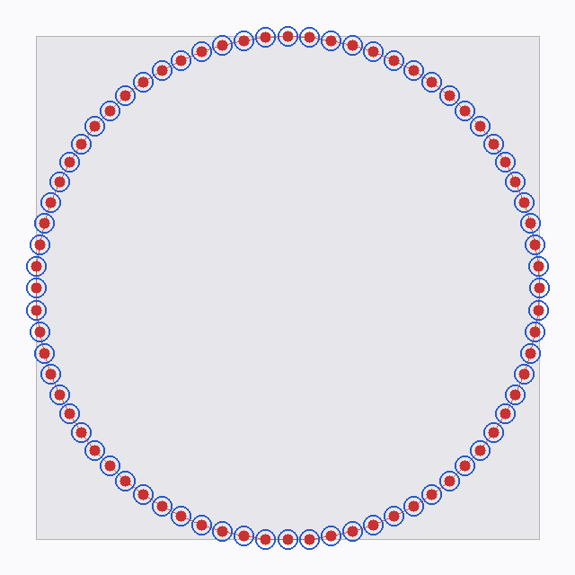
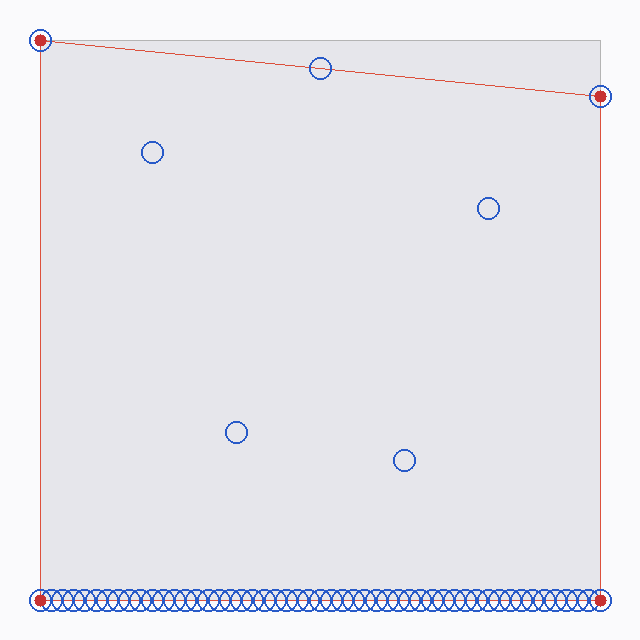
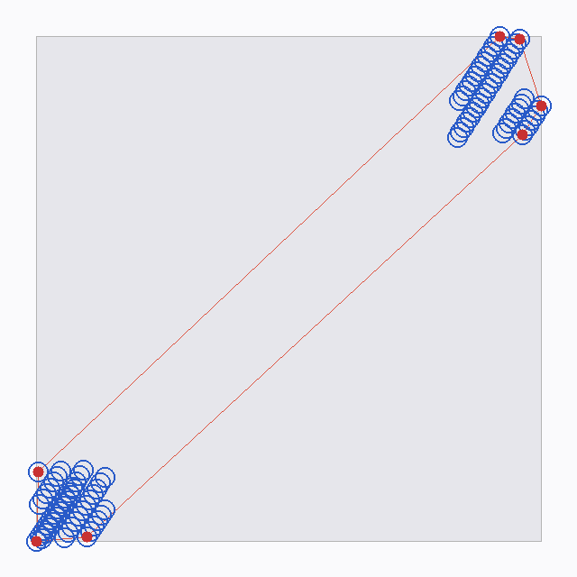

# HullFinder Specs

Living list of requirements and investigation notes. Update as work progresses.

## Visualization
- [x] Render 2D point sets and hull perimeter as PNG (no Win32 GUI)
- [x] Use Go stdlib only for drawing/encoding (`image`, `image/png`, `image/color`)
- [x] Show all input points and, when present, perimeter/hull edges
- [x] Overlap visibility: larger blue outlines under smaller filled red hull markers
- [x] Single shared helper usable from all unit tests: write current image state to a given file path (`writeHullImage` → `WriteHullImage`)
- [x] Helper must work for any point set (inline, CSV-loaded, or fixture)

## Input
- [x] Load points from CSV (`LoadPointsFromCSV` / `ReadPointsCSV`)
- [x] Support visualizing any arbitrary set of points via that loader + helper
- [x] CLI: `go run . [points.csv] [out.png]`

## Correctness / error cases (tests)
- [x] Empty / no points
- [x] Single point
- [x] Greatest Y coincides with least X
- [x] Greatest Y coincides with most X
- [x] Least Y coincides with least X
- [x] Least Y coincides with most X
- [x] Existing happy path: 6×6 arrangement (`Test_6By6`) — expected set corrected to true convex hull
- [x] Existing helpers: `findHighestPoint` / `findLowestPoint`
- [x] Bad CSV row returns an error
- [x] CSV sample loads and visualizes
- [x] Large-coordinate (`[0,2000]×[0,2000]`) fixtures covering distinct algorithm aspects (`testdata/dim2000/`)

## Algorithm / starter code
- [x] Keep existing types (`point`, `points`, `hull`, `hullFinder`, `convexHullFinder`)
- [x] `findPerimeter` must compile and return perimeter `points`
- [x] Preserve `findHighestPoint` / `findLowestPoint` for calculations
- [x] Upper/lower chains use farthest-from-edge (cross product), not max/min Y alone
- [x] **By design, only extreme (outside) points appear on the hull** — interior points stay blue-outline-only (see investigation below)

## Engineering constraints
- [x] Cheap: PNG file output is sufficient
- [x] Changes must be inspectable via generated images (tests write PNGs under `testdata/out/`)
- [x] Prefer minimal deps (stdlib only)
- [x] Keep curated screenshots under `docs/screenshots/` (tracked in git; `testdata/out/` remains ephemeral)

## Open / follow-ups
- [ ] Quiet debug `fmt.Printf` noise in hull helpers during tests
- [ ] Optional: visualize intermediate recursion steps
- [ ] Optional: label coordinates on PNG

---

## Investigation: empty blue circle in `leastY_is_leastX`

**Screenshot (after blue-outline + red-fill styling):**



**Reference happy path (6×6) for legend comparison:**



### Concern

> Only outside indexes seem to be considered — the empty blue circle is not on the red path.

### Input (`Test_LeastYIsLeastX`)

| Point | Role |
|-------|------|
| `(0, 0)` | least X and least Y — on hull |
| `(1, 3)` | upper chain — on hull |
| `(2, 4)` | greatest Y — on hull |
| `(3, 2)` | **empty blue circle** — interior |
| `(4, 1)` | most X — on hull |

### What the image shows

- Four red vertices + red edges: `(0,0) → (1,3) → (2,4) → (4,1) → (0,0)`
- One blue outline with **no** red fill: `(3, 2)`, clearly inside that quadrilateral

### Why `(3, 2)` is excluded (not a bug)

This program computes a **convex hull** (outer perimeter), not a path that visits every point (TSP / “shortest tour through all points”).

`findPerimeter` only keeps points that are extreme relative to an edge:

1. Endpoints = least-X / most-X.
2. Upper chain = points farthest **above** each edge (`cross > 0`).
3. Lower chain = points farthest **below** each edge (`cross < 0`).

For edge `(2,4) → (4,1)`:

```text
cross((2,4), (4,1), (3,2)) = (4-2)*(2-4) - (1-4)*(3-2)
                           = 2*(-2) - (-3)*(1)
                           = -4 + 3
                           = -1  (< 0 → below the upper edge → interior side)
```

`(3,2)` is never farthest on either side of any hull edge, so it correctly stays blue-outline-only.

### Verdict

| Question | Answer |
|----------|--------|
| Are only “outside” points on the red path? | **Yes — that is the definition of the convex hull.** |
| Is the empty blue circle a missed hull vertex? | **No — it is interior.** |
| Would a “visit all points” path include it? | Yes, but that is a different problem (not implemented). |

### Spec takeaway

- [x] Documented: interior points must appear as blue outlines without red fill
- [x] Documented: red path is the convex perimeter, not an all-points tour
- [ ] If product goal changes to visit-all / shortest path through every point, open a new algorithm track (out of scope for current hull finder)

---

## Large fixtures: `testdata/dim2000/`

Coordinates span `[0, 2000] × [0, 2000]`. Regenerated with:

```bash
go run testdata/gendata.go
```

Visualized by `Test_Dim2000Fixtures` → `testdata/out/dim2000_*.png`.

| Fixture | Aspect exercised |
|---------|------------------|
| `01_interior_cloud` | Many interior points → few hull extremes |
| `02_circle_ring` | Almost every sample is a hull vertex |
| `03_bounding_square` | Full-plane corners dominate the hull |
| `04_upper_heavy` | Asymmetric upper vs lower chains |
| `05_collinear_base` | Collinear bottom edge (only endpoints matter) |
| `06_diamond` | Mid-plane diamond + interior fill |
| `07_two_clusters` | Hull bridges two separated blobs |
| `08_axis_cross` | Axis-aligned cross + corner outliers |
| `09_thin_vertical` | Narrow X range / near-vertical set |
| `10_grid_lattice` | Regular grid → rectangular hull |

### Screenshots

**Interior cloud (few red vertices, many blue outlines):**



**Circle ring (dense red perimeter):**



**Collinear base:**



**Two clusters:**


